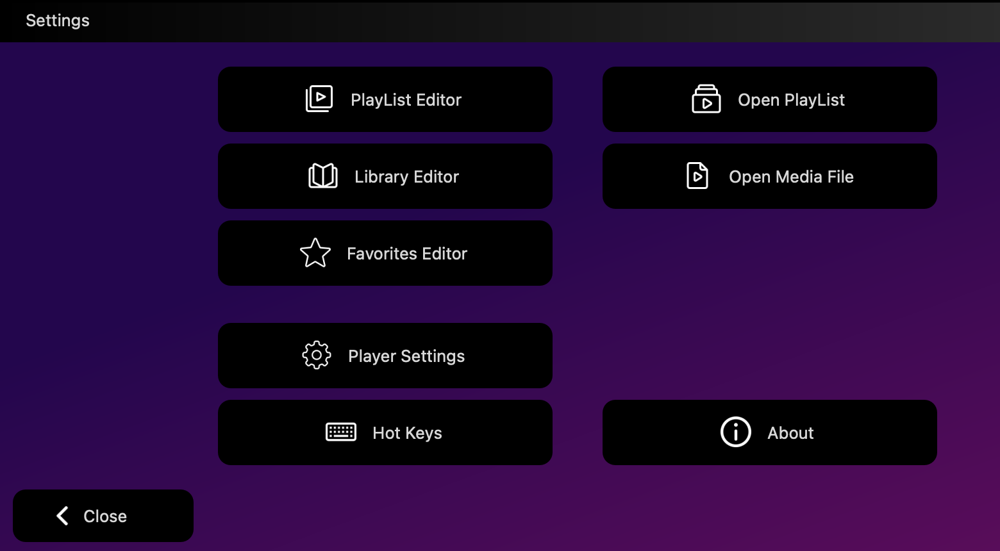
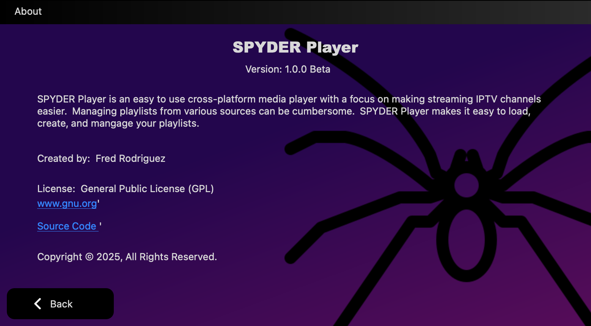

SPYDER Player is an easy to use cross-platform media player with a focus on making streaming IPTV channels easier.  Managing m3u playlists from various sources can be cumbersome.  SPYDER Player makes it easy to load, create, and mangage your playlists in a clean interface.

SPYDER Player allows you to load multiple m3u files locally or remotely.  You can easily add and remove channels to your Favorites list by clicking on the star next to the channel.  You can also load local media files and store them in a Libraries list.  All loaded playlists are searchable.

The code for this is written in C++ and Qt 6.9 utilizing the QMediaPlayer libraries.  Originally, this project was written in pyton and pyqt6.  The repository for that is in my github.  I decided to migrate this project to C++ to make it leaner on system resources (both on disk and in RAM).

Main Window:

Settings Windows:

Playlist Editor:

About Screen:

Image Credits:
- All images used in this project where found on https://www.flaticon.com
- [Credited images](docs/ImageSources.md)

To Do:
- More testing and bug finding
- Create Installers for all Operating Systems
- Release first version
